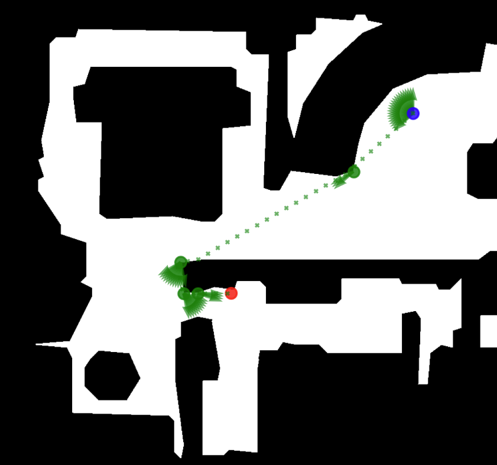
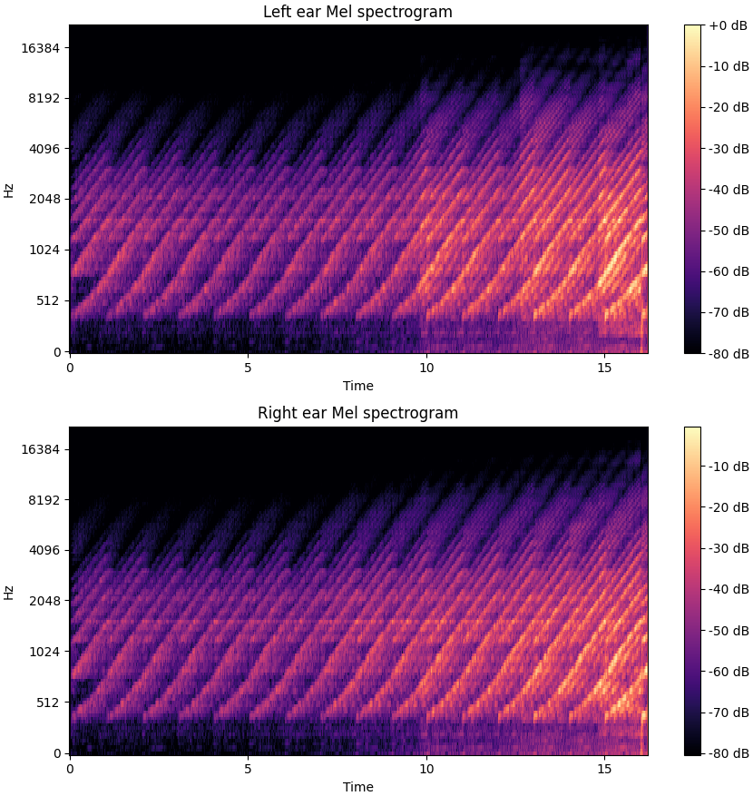

<p align="center">
  <br>
  
  
  <br>
</p>

<div align="center">
  <table width="750" height="300">
    <tr>
      <td align="center" width="375" height="10">
        <video src="https://github.com/user-attachments/assets/541448d0-57e1-4874-82a4-ae5d3d38c718" controls></video>
        <b>Original Dry Sound</b>
      </td>
      <td align="center" width="375" height="10">
        <video src="https://github.com/user-attachments/assets/eaf6176a-b589-4d5b-b225-d115c33f27c1" controls></video>
        <b>Spatialized Sound</b>
      </td>
    </tr>
  </table>
</div>

*Figure 1: Visual and auditory breakdown of an agent's navigation. The navmesh path (left) correlates directly with the left and right ear Mel spectrograms (right). Use the audio players to compare the original dry sound with the spatialized output. Notice the interaural volume differences when the agent rounds a corner, a spatial acoustic effect clearly reflected in the spectrograms.*

# Welcome to AudioWorldSim

This is a custom version of [SoundSpaces by Meta](https://github.com/facebookresearch/sound-spaces/tree/main), designed to generate realistic binaural audio datasets for the development of [Audio-Based World Models](https://github.com/Luizerko/audio-nav).

This project was developed by [Luis Zerkowski](https://luizerko.github.io/) under the supervision of [Luiz Velho](https://lvelho.impa.br/) at [VISGRAF](https://www.visgraf.impa.br/home/index.php), the Vision and Graphics Laboratory at [IMPA](https://impa.br/?lang=en).

---

## Introduction

The primary goal of this project is to build a realistic binaural audio dataset utilizing the 3D scenes from [Matterport](https://matterport.com/partners/meta) and [Replica](https://github.com/facebookresearch/replica-dataset). We later used this dataset to train an [Audio-Based World Model](https://github.com/Luizerko/audio-nav).

To achieve this, we built a custom simulator on top of [SoundSpaces](https://github.com/facebookresearch/sound-spaces/tree/main). It leverages their comprehensive acoustics framework but focuses heavily on the **automatic rollout of random agent navigations**. In our simulator, the agent and sound source start at valid locations on the same level of a 3D scene's navmesh, and the agent navigates to the sound via the shortest path. We also implemented crucial fixes to how continuous sound is composed (more on this in the [Technical Notes](TECHNICALNOTES.md)).

Due to derivation distribution limitations on both 3D scene datasets, we cannot provide open access to the dataset itself. Instead, we are open-sourcing the simulator so you can build your own. 

> **Note on datasets:** To generate your own dataset, you must request access to and download both Matterport and Replica yourself. While Replica is easier to access, **we strongly advise using Matterport**. The SoundSpaces acoustic framework performs significantly better on Matterport, and the materials support (which adjusts acoustics based on surface materials) only works for it.

> **Disclaimer:** the material support in the latest version of SoundSpaces is unreliable and can occasionally corrupt the sound.

---

## Why Is This Work Important?

If you've tried setting up [SoundSpaces](https://github.com/facebookresearch/sound-spaces/tree/main) before, you know it can be a headache. 

* **Streamlined Dependencies:** The original installation guide builds on the headless [Habitat-Sim](https://github.com/facebookresearch/habitat-sim), but you need the full software to run their continuous simulator. Because they rely on specific, outdated versions of both Habitat-Sim and [Habitat-Lab](https://github.com/facebookresearch/habitat-lab/tree/main), resolving compatibility issues is tricky. We bypassed this by utilizing only their sound simulation infrastructure and created a minimal, targeted simulator on top of it. Since we only cared about the audio output, we ensured we could run continuous navigations rather than just pulling spatialized sound for a single (sound source, agent pose) pair.

* **Crucial Audio Bug Fix:** We patched an audio bug in the original continuous simulator that caused noticeable clicking sounds between simulation steps. These artifacts are annoying to listen to and detrimental to machine learning models, which can easily (and unintentionally) learn these unnatural patterns. You can hear the original artifacting in their [original demo video](https://www.youtube.com/watch?v=4uiptTUyq30). Check the [Technical Notes](TECHNICALNOTES.md) for a deep dive into how we fixed this.

---

## Installation Guide

1. Follow the [installation guide from SoundSpaces](https://github.com/facebookresearch/sound-spaces/blob/main/INSTALLATION.md).

2. When you reach the dataset section, download only [Matterport](https://matterport.com/partners/meta) and/or [Replica](https://github.com/facebookresearch/replica-dataset).

> SoundSpaces offers an MP3D test scene in their [Matterport3D documentation](https://github.com/facebookresearch/habitat-sim/blob/main/DATASETS.md#matterport3d-mp3d-dataset). Since their official download command is currently broken, we've provided a `download_mp3d_example.py` script that fixes the issue and fetches the exact same scene for you. 

3. **Skip** the SoundSpaces 1.0 instructions and proceed directly to the SoundSpaces 2.0 instructions.

If you can successfully run their `minimal_example.py`, you are ready to run our simulator! If you run into issues, the SoundSpaces [issues page](https://github.com/facebookresearch/sound-spaces/issues) still contains some good troubleshooting discussions.

---

## How to Set Up and Run the Simulation

By now, your `data` directory should look like this:

```text
data/
|-- mp3d_material_config.json
|-- scene_datasets/
    |-- mp3d/
    |   |-- mp3d.scene_dataset_config.json
    |   |-- 17DRP5sb8fy/
    |   |-- ... # Additional IDs
    |-- replica/
        |-- replica.scene_dataset_config.json
        |-- apartment_0/
        |-- ... # Additional IDs
```

### Running Your First Simulation

Activate your environment with `conda activate ss`, then run a default simulation using a command like this:

```bash
python custom_simulator/simulator.py --dataset_instance mp3d.17DRP5sb8fy --input_audio <path/to/audio.wav>
```

**Configuration Arguments:**

* `--dataset_instance`: Name of the dataset and instance (e.g., `mp3d.17DRP5sb8fy` or `replica.apartment_0`).

* `--input_audio`: Path to your source audio file.

* `--sample_rate`: Sample rate for sound simulation and spatialization (Default: `44100` Hz). The simulator will automatically resample your input audio if it doesn't match.

* `--simulation`: Choose the simulation mode. `'static'` for a single Impulse Response (IR) computation, or `'rollout'` (default) for a specified sequence of actions and observations.

* `--navigation`: *(Rollout only)* Choose how the agent moves. If `'manual'`, you must modify the code to position, orient, and move the agent. If `'target'`, the simulator uses the navmesh to sample a random start point and end point (on the same floor) where the sound source is, navigating the agent via the shortest path.

* `--time_step`: The time duration per step in the kinematic simulation. Since physics are disabled, the agent essentially "teleports." By default, a forward action moves the agent 0.2m, so we use `0.2` seconds as a reasonable default time-step. **Note:** This is a delicate parameter. Too high, and the agent moves unnaturally slow; too low, and it moves too fast. These variations impact how a world model perceives the consequences of its actions. You can adjust the movement scale in the code through `move_forward`, `turn_left` and `turn_right` configurations.

* `--verbose`: Prints and plots some information for debugging.

* `--video`: Generates a video of the navmesh plot and navigation. *(Note: Framerate can be slightly buggy, so video length might differ marginally from the audio length).*

* `--seed`: Set a specific seed for reproducibility.

**Output:** Once the simulation finishes, it will generate an instance folder alongside your input audio. It will follow this hierarchy: `17DRP5sb8fy/rollout/target/seed_<int>/`. Inside, you will find:

1.  `action_list.txt`: The exact sequence of actions taken (1: forward, 2: turn left, 3: turn right). Essential for training world models.

2.  `navigation.jpg`: A plot of the navmesh showing the agent's start point (blue circle), the target sound source (red circle), intermediate shortest-path goals (green circle), positions visited (green x's), and look directions (green arrows).

3.  `output.wav`: The final binaural audio output.

### Creating Your Own Dataset

To run simulations at scale, use the `generate_dataset.sh` script. Make the script executable with `chmod +x generate_dataset.sh`, and update the parameters (number of simulations, parallel workers, `dataset_instance`, and `input_audio`).

To give an idea of what to expect from dataset generation, we provide a performance benchmark. For Matterport instance `17DRP5sb8fy`, we successfully ran 30 parallel workers (consuming ~28GB of RAM) on an Intel Core i9-10980XE (36 cores). Generating 1000 simulations (yielding ~4 hours of audio) took ~3 hours. 

> **Note on stuck runs:** ~1% of simulations get stuck due to drift caused by imprecise turning and forward movements. Don’t worry about these! Even if the agent doesn't reach the target, you still get a valid (albeit shorter) spatial audio output and navigation path. It is worth noting that ~5% of runs fail due to crashes in the SoundSpaces simulator. While we were not able to find a workaround in time, this edge case affects only a small fraction of the dataset, ensuring ample data can still be successfully generated.
<br>

**Audio Processing Pipeline:** The `generate_dataset.sh` script also triggers `custom_simulator/audio_processing.py`, a tool designed to format the audio specifically for ML tasks. For each seed, it generates:

* `full_mel.npz`: Full Mel spectrogram

* `mel_ref_power.npz`: Max power reference for Mel spectrogram (important for audio reconstruction from Mel spectrograms).

* `full_stft.npz`: Full raw STFT output

* `split_mel.npz` and `split_stft.npz`: Segmented versions of both, sliced per action (default: 0.2 seconds, tied to your `time_step`).

If you alter your `time_step` or `sample_rate` on `custom_simulator/simulator.py`, remember to update `custom_simulator/audio_processing.py` to match. 

**Quality Check:** After generation, make `dataset_quality.sh` executable (`chmod +x dataset_quality.sh`) and run it to view dataset statistics (total runs, stuck runs, total audio duration in seconds) and flag problematic seeds (on `problematic_seeds.txt`).

---

## Attributions

If you found this work helpful, please cite our technical report:

```text
[You'll se an arxiv link here soon :)]
```

Please also ensure you cite [SoundSpaces](https://github.com/facebookresearch/sound-spaces/tree/main) and check their [LICENCE](https://github.com/facebookresearch/sound-spaces/blob/main/LICENSE), as this simulator is heavily reliant on their foundational framework. We also strongly encourage citing the original 3D scene datasets ([Matterport](https://matterport.com/partners/meta)/[Replica](https://github.com/facebookresearch/replica-dataset)) if you used them.
