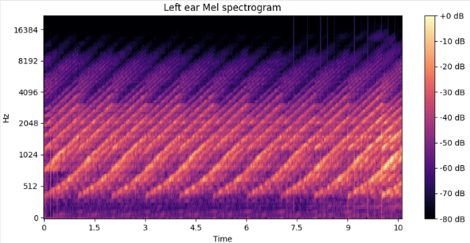
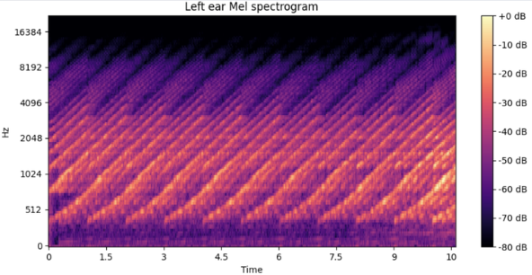
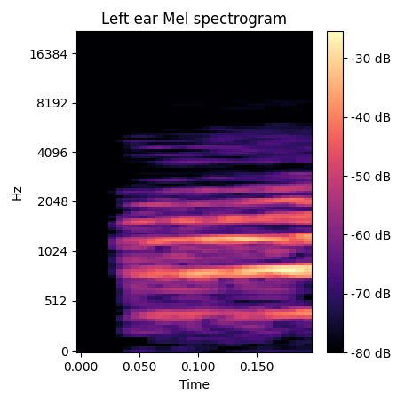
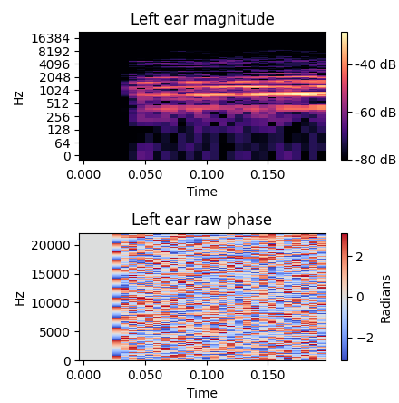

# Technical Notes

We wrote this section so we could go through some aspects of our implementation more in detail.

## The Clicking Bug Fix

The fix we implemented is straightforward in code but nuanced conceptually. 

To simulate continuous audio across discrete agent steps (similar to SoundSpaces' original approach), we save the Impulse Response (IR) of the agent's pose at time *t*. We then take a step to time *t+1* and grab the new IR. We convolve both IRs with the sound segment at *t+1*. The first represents what the audio *would* sound like if we hadn't moved, and the second represents the audio at the new location. We then crossfade them to create a seamless transition. 

> **Disclaimer:** The original implementation crossfaded using the sound at time *t* instead of *t+1*, which caused a slight loss of continuity. We corrected this.*

**The Root Cause of the Clicking:** Different spatial positions have IRs of different lengths due to varying acoustic reverb. If you don't properly zero-pad the shorter IRs so they all match in length, your convoluted audio segments will be misaligned in time during the crossfade.

If a past IR is longer than a current IR, it effectively shifts the past audio into the future. When the crossfade ends and snapping occurs to the current IR, the sudden audio shift causes a harsh "click." This is why the [original demo video](https://www.youtube.com/watch?v=4uiptTUyq30&feature=youtu.be) sounds worse near the end of a navigation: as the agent approaches the sound source, the direct sound increases, reverb decreases, and the new IRs become significantly shorter than the past IRs.

  <table style="border: none; border-collapse: collapse;">
    <tr>
      <td align="center" style="border: none; padding-bottom: 0;">
        
      </td>
      <td align="center" style="border: none; padding-bottom: 0;">
        
      </td>
    </tr>
    <tr>
      <td align="center" style="border: none; padding-bottom: 0;">
        <video src="assets/broken_crossfade.wav" controls></video> 
        <b>Broken Spatialized Sound</b>
      </td>
      <td align="center" style="border: none; padding-bottom: 0;">
        <video src="assets/fixed_crossfade.wav" controls></video> 
        <b>Fixed Spatialized Sound</b>
      </td>
    </tr>
  </table>

*Figure 1: Mel spectrogram comparison. Left: Original implementation showing vertical artifact lines (clicking sounds) between simulation steps. Right: Our corrected implementation with proper zero-padding, resulting in an artifact-free audio continuum.*

## Audio Processing Strategy

**Mel Spectrograms:** We compute these using 2048 samples and 128 bands, with a default hop length of 147 for superior resolution. Given our 44100 Hz sample rate and 0.2s time-step, we process 8820 samples per action. With a 147 hop length, this yields 60 frames per action (a 128x60 Mel spectrogram per action). If you adjust the `hop_len` in `audio_processing.py`, ensure that `(sample_rate * time_step) / hop_len` results in an integer.

We deliberately prioritize frequency resolution over time resolution (using 2048 samples). Because Mel spectrograms ignore frequency phase (meaning we lose Internal Time Difference (ITD) anyway), increasing frequency clarity is the optimal trade-off.

**Raw STFT:** Here, we capture ITD so we use 1024 samples to preserve better time resolution and phase information, which is crucial for the world model's spatial understanding. Using 512 frequency bands (because of 1024 samples) and the same hop length of 147, we generate 512x60 raw spectrograms per action. We preserve the raw complex numbers so they can be utilized directly in complex-valued neural networks though, natively encoding both amplitude and phase.

  <table style="border: none; border-collapse: collapse;">
    <tr>
      <td align="center" style="border: none; padding-bottom: 0;">
        
      </td>
      <td align="center" style="border: none; padding-bottom: 0;">
        
      </td>
    </tr>
  </table>

*Figure 2: Comparison of output formats. Left: a segment of the generated Mel spectrogram (prioritizing frequency resolution). Right: a segment of the raw STFT output (preserving phase information for spatial mapping).*